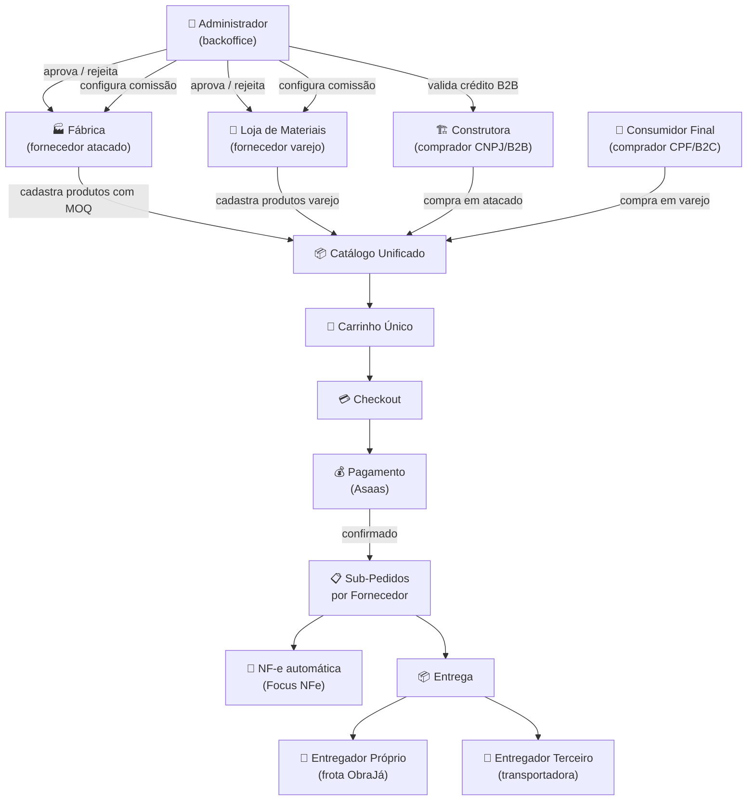
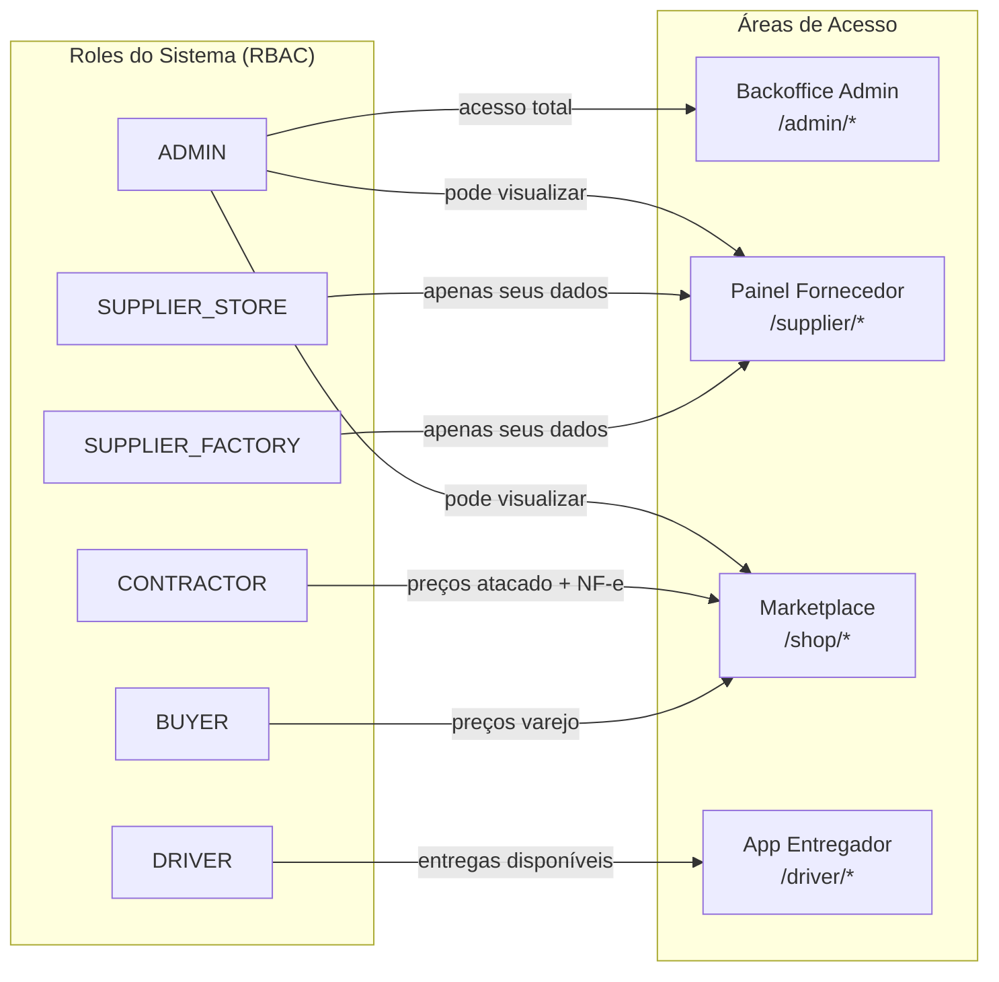
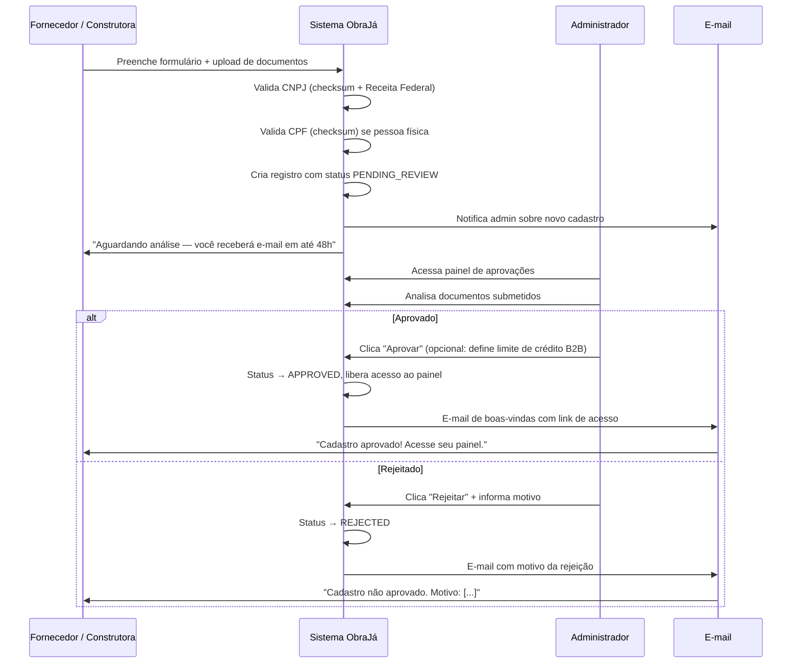
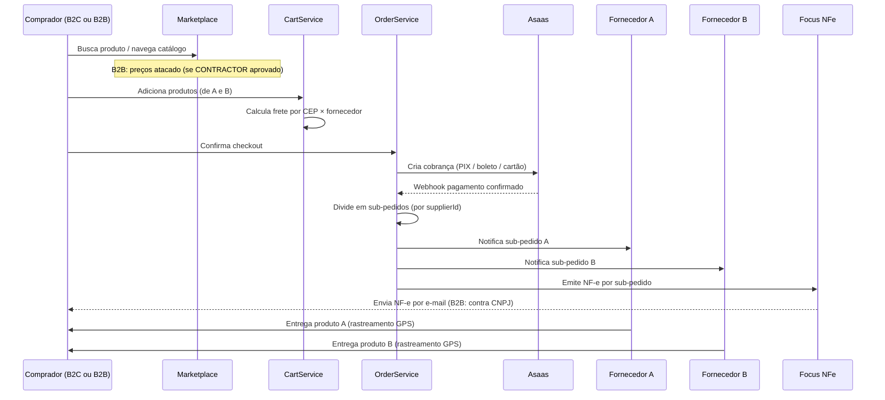
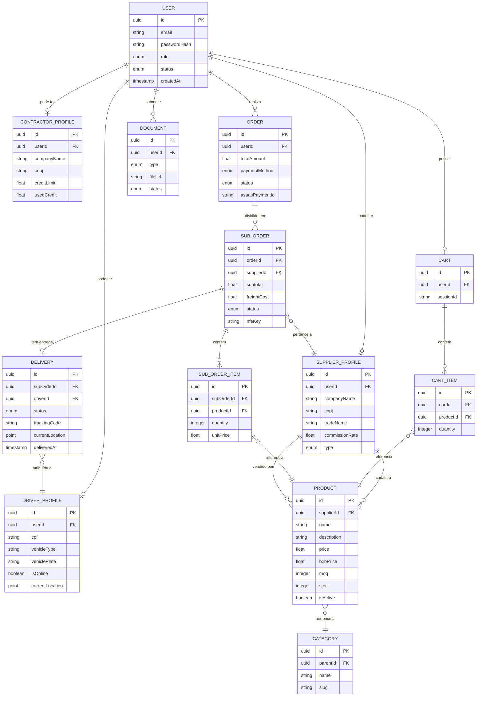
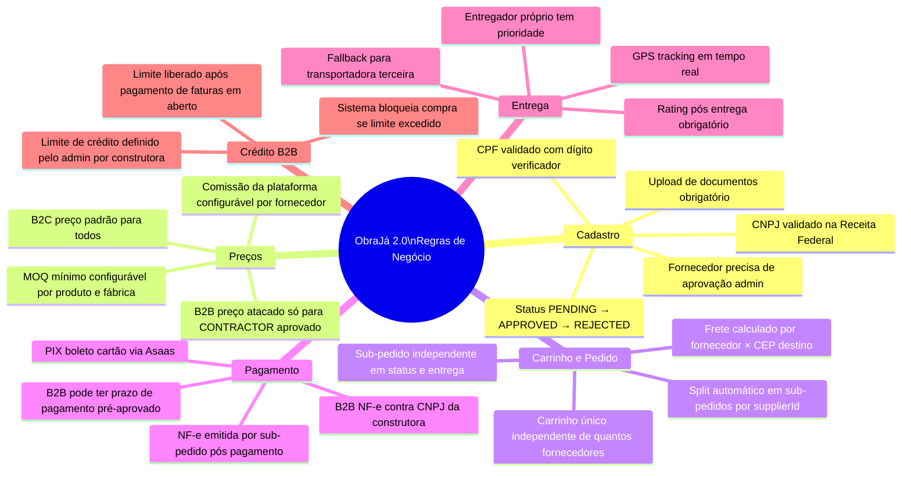
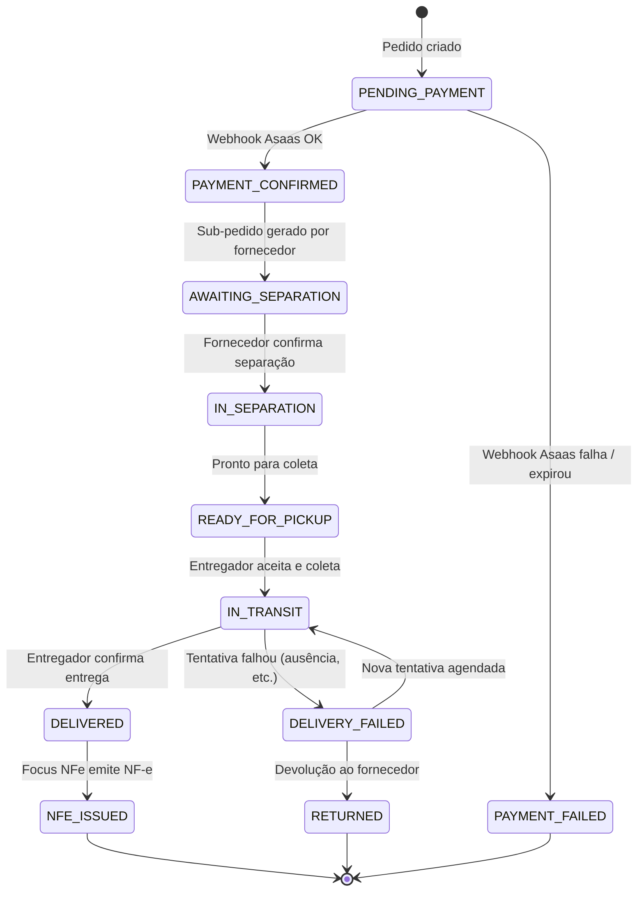

# ObraJá 2.0 — Contexto de Negócio

> Diagrama de memória da lógica de negócio. Use como referência para entender atores, fluxos e regras antes de iniciar qualquer módulo.

---

## 1. Atores do Sistema



---

## 2. Mapa de Roles e Permissões



---

## 3. Fluxo de Aprovação de Cadastro



---

## 4. Fluxo de Compra (B2C e B2B)



---

## 5. Diagrama de Entidades (ER Simplificado)



---

## 6. Mapa de Regras de Negócio



---

## 7. Ciclo de Vida do Pedido



---

## 8. Hierarquia de Categorias (Exemplo)

```
Materiais de Construção
├── Estrutura
│   ├── Cimento e Argamassa
│   ├── Tijolos e Blocos
│   └── Vergalhões e Aço
├── Revestimento
│   ├── Cerâmica e Porcelanato
│   ├── Tinta e Textura
│   └── Pedra e Granito
├── Hidráulica
│   ├── Tubos e Conexões
│   ├── Caixas d'água
│   └── Registros e Válvulas
├── Elétrica
│   ├── Fios e Cabos
│   ├── Quadros Elétricos
│   └── Tomadas e Interruptores
├── Ferramentas
│   ├── Manuais
│   ├── Elétricas
│   └── EPI
└── Acabamento
    ├── Portas e Janelas
    ├── Pisos Externos
    └── Gesso e Drywall
```

---

## 9. Resumo Executivo — Decisões de Arquitetura

| Decisão | Escolha | Por quê |
|---------|---------|---------|
| Banco de dados | PostgreSQL self-managed | Controle total, RLS nativo, sem vendor lock-in |
| ORM | Prisma | Type-safety, migrations, eco NestJS |
| Auth | JWT + HttpOnly cookie | Segurança XSS superior a localStorage |
| Storage | Cloudflare R2 | S3-compatível, barato, CDN global |
| Pagamento | Asaas | Melhor integração PIX/boleto para Brasil |
| NF-e | Focus NFe | API simples, suporta NF-e + NFS-e + CT-e |
| Monorepo | Turborepo | Cache de build, compartilhamento de código |
| Filas | BullMQ + Redis | Processamento assíncrono (NF-e, emails, push) |
| Mobile | React Native + Expo | Reuso de código web (React), ecossistema maduro |
